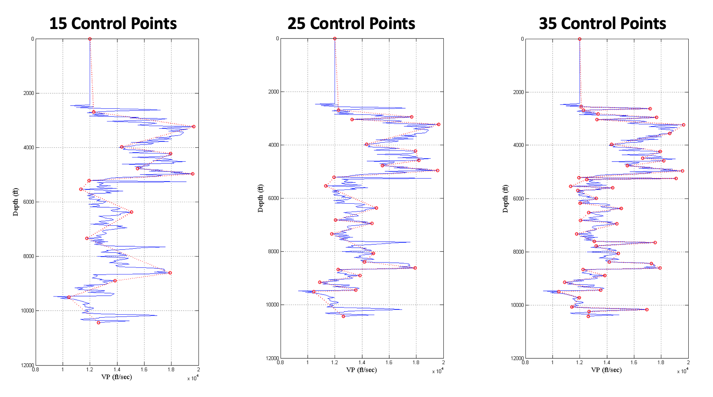

# Optimal Knots for Spline
> A Novel Algorithm to Find Optimal Knots 
> to Model Well Logs Using Spline Method

In the oil and gas exploration and development projects, well logs are used frequently. Sometime, we need to simplify our well logs using simple models like B-spline. An example for this situation might be a tomography job, where velocity logs need to be modeled using a spline model.

Finding optimum knots for a spline model could be quite challenging. Here, I introduced a novel approach to find the optimal number of knots. Using this code, you can find the optimal number of knots as well as generating your spline model.

The input to this model could be any kind of well logs. It needs at least two columns. Column 1 is depth and column 2 is your measurement (VP, VS, RHOB, GR, etc.). 

The method uses a novel algorithm which calculates the cost of removing a knot from linear spline interpolation. The least expensive knots will be removed and the process repeats until we get to the desired number of knots. At the end, we compute the different between the original log and the spline-modeled log. The process repeats for different number of desired knots to find the optimum number of knots.

## Running the Code
Run the codes in MATLAB.

